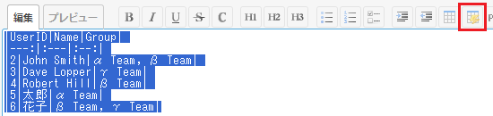
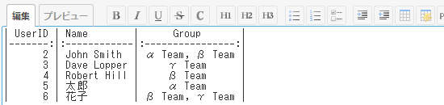

# Redmine Wiki Table Formatter
This is a plugin for Redmine.  
This plugin adds a button to jsToolbar that formats the selected table when using the Markdown or CommonMark Markdown text format.

## Image
### Before

### After


## Installation
### When using git
1. Clone this repository to your Redmine plugins directory.
    ```
    cd YOUR_REDMINE_DIRECTORY/plugins
    git clone https://github.com/sk-ys/redmine_wiki_table_formatter.git
    ```
2. Restart Redmine.

### When not using git
1. Download zip file from the [release page](https://github.com/sk-ys/redmine_wiki_table_formatter/releases) or the [latest main repository](https://github.com/sk-ys/redmine_wiki_table_formatter/archive/refs/heads/main.zip). 
2. Extract the ZIP file to your Redmine plugin directory. The name of the unzipped directory must be `redmine_wiki_table_formatter`.
3. Restart Redmine.
